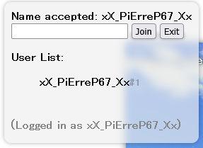
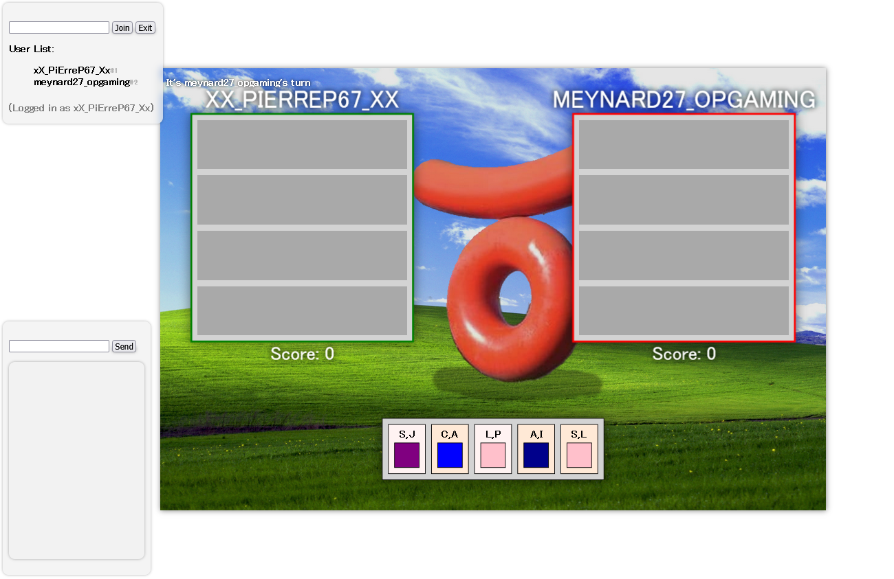

# nodejs-game
*par Soheil et Prosper*

jeu des bibliothèques connexions de joueurs via socket.io<BR>
<BR>
Le jeu se joue en tour par tour. Chaque joueur dispose d'une bibliothèque qu'il doit remplir avec un livre qu'il choisit parmi 5 livres proposés à chaque tour. Chaque livre a un genre et un format. Le but du jeu est de maximiser le score de sa bibliothèque en fonction des livres choisis.<BR>

## Installation

besoin de nodejs et npm:
```bash
sudo apt install nodejs npm
```
innitialiser le projet:
```bash
npm init -y
```

puis mettre en place les dépendances:
```bash
npm install express socket.io
```

## Lancement et Utilisation

lancer le serveur:
```bash
node server.js
```

### Pour se connecter sur le jeu:

    ouvrir un navigateur à l'adresse http://localhost:8888<BR>

### Pour y accéder depuis une autre machine du réseau local:

    trouver l'adresse IP locale de la machine qui héberge le serveur:<BR>

- sur **linux** :
```bash
hostname -I
```
- sur **windows** :
```bash
ipconfig
```

puis ouvrir un navigateur à l'adresse `http://(adresse_ip_locale):8888`<BR>

## Calcul des scores:

- Si la ligne est complete et triée par ordre alphabetique (auteur): 3pts par livre
- Si la ligne est icomplète mais dans l'ordre alphabétique (auteur): 2pts par livre
- Pour un combo de 3+ livres de même format/genre: 2^n avec n nombre de livres dans le combo (sur les colonnes et les lignes)

## Captures d'écran:

voici l'interface de base:<BR>
<BR>
pierre rejoint la partie:<BR>
<BR>
meynard rejoint la partie:<BR>
<BR>
meynard place un livre:<BR>
<BR>
meynard obtient un combo:<BR>
<BR>

## Lien du projet:
https://github.com/Soyoudv/nodejs-game